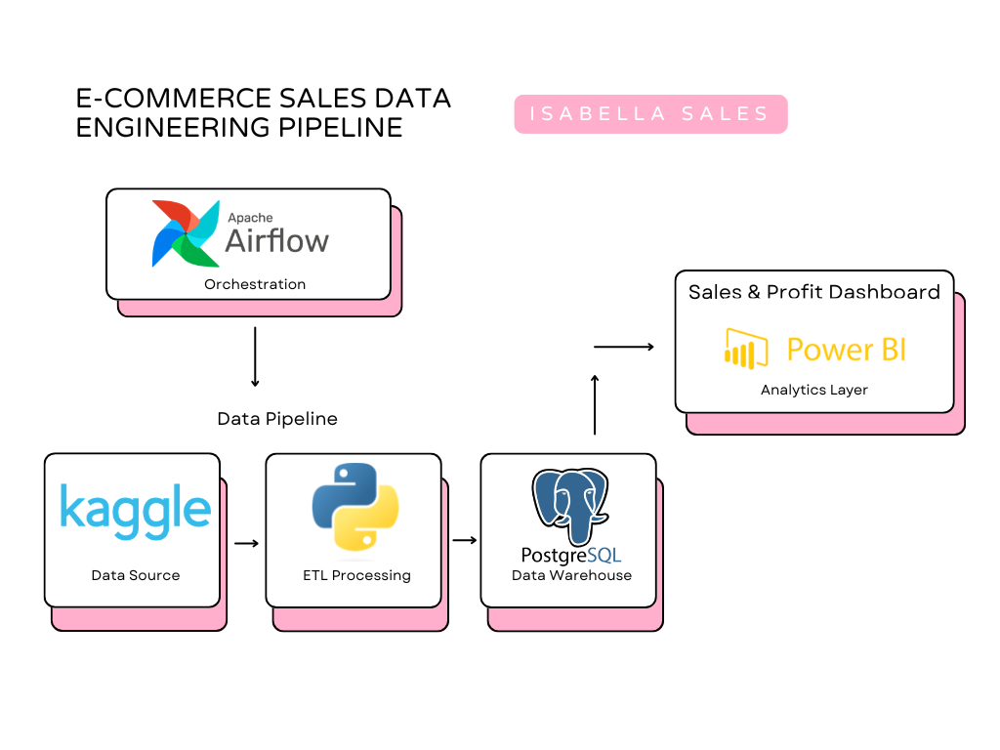

# 🛒 E-Commerce Sales Data Engineering Pipeline

Pipeline completo de Engenharia de Dados para processamento e análise de dados de vendas de e-commerce, utilizando Apache Airflow, Docker, PostgreSQL e Power BI.

---

##  Objetivo

Construir um pipeline de dados moderno que:

- Extraia dados de vendas
- Realize transformações e limpeza
- Carregue os dados em um banco relacional
- Orquestre o fluxo com Apache Airflow
- Disponibilize dados estruturados para análise e visualização

Este projeto simula um ambiente real de Engenharia de Dados.

---

##  Arquitetura



---

##  Fluxo do Pipeline (ETL)

###  Extração (Extract)
- Leitura do dataset de pedidos de vendas (Sales Order Dataset - Kaggle)
- Ingestão via script Python

### Transformação (Transform)
- Limpeza de dados
- Tratamento de valores nulos
- Conversão de tipos (datas, valores monetários)
- Padronização de colunas
- Criação de métricas:
  - Receita Total
  - Ticket Médio
  - Receita por Região
  - Receita por Categoria

###  Carga (Load)
- Inserção dos dados tratados no PostgreSQL
- Estruturação em modelo analítico

###  Orquestração
- Pipeline automatizado com Apache Airflow
- DAG com tarefas separadas (extract → transform → load)
- Execução agendada

###  Visualização
- Dashboard desenvolvido no Power BI
- Análise de KPIs de vendas

---

## Tecnologias Utilizadas

- Python
- Apache Airflow
- Docker
- PostgreSQL
- Pandas
- Power BI

---

## Estrutura do Projeto

```ecommerce-data-pipeline/
│
├── dags/
│ └── ecommerce_pipeline.py
│
├── data/
│ └── sales_orders.csv
│
├── scripts/
│ ├── extract.py
│ ├── transform.py
│ └── load.py
│
├── docker-compose.yml
├── requirements.txt
└── README.md
```

## 📊 KPIs Monitorados

- Receita Total
- Número de Pedidos
- Ticket Médio
- Receita por Região
- Receita por Categoria
- Evolução Mensal de Vendas

---

## Como Executar o Projeto

### Clonar o repositório


```bash
git clone https://github.com/seuusuario/ecommerce-data-pipeline.git
```
## Subir o ambiente com Docker
```bash docker-compose up ```

## Acessar o Airflow
Acesse no navegador:
http://localhost:8080

## Usuário padrão:
airflow

## Senha padrão:
airflow

## Ativar a DAG
ecommerce_sales_pipeline

### Resultados
Este projeto demonstra:

- Construção de pipeline de dados ponta a ponta

- Orquestração com Airflow

- Integração com banco relacional

- Modelagem para análise

- Preparação de dados para BI

### Próximos Passos (Evolução do Projeto)
- Implementar Data Quality Checks

- Criar modelo dimensional (Star Schema)

- Implementar testes automatizados

- Migrar para ambiente em nuvem (AWS ou GCP)

- Adicionar monitoramento e logs estruturados


### 👩‍💻 Autora

## Isabella Sales
## Data Analyst | Data Engineer | Data Science & Big Data
